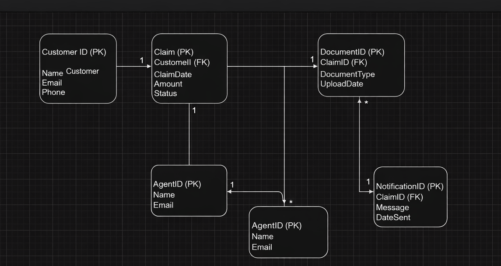

# Entity Relationship Diagram (ERD)

This ER diagram represents the database structure for the Travel Insurance Claim System.

Entities included in the model:

- Customer
- Policy
- Claim
- Claim Document
- Insurance Agent
- Payment

The diagram illustrates relationships between customers, policies, and submitted travel insurance claims.

## ER Diagram

