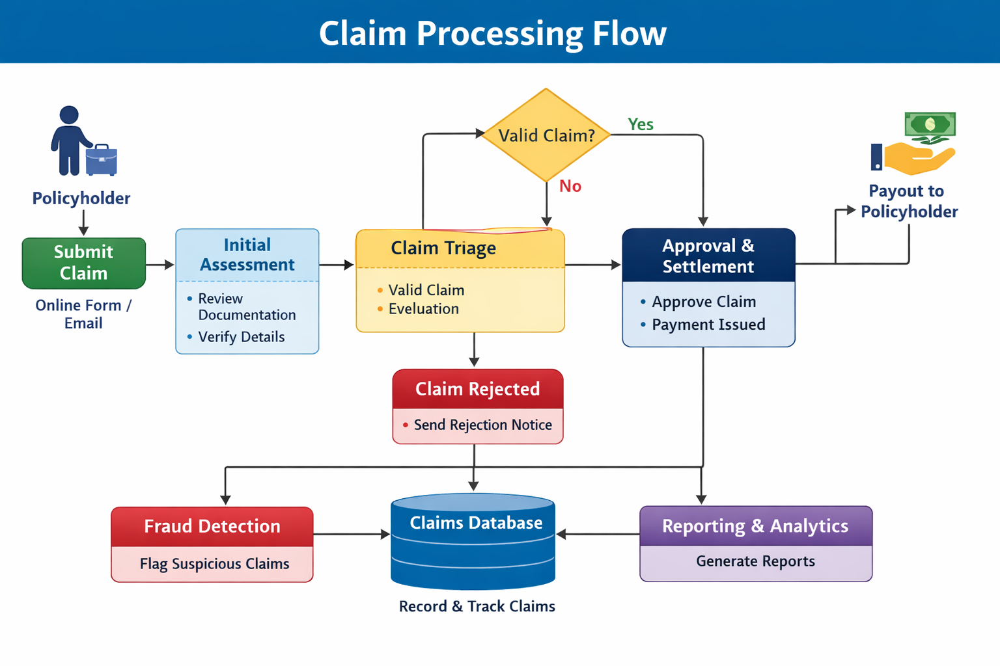
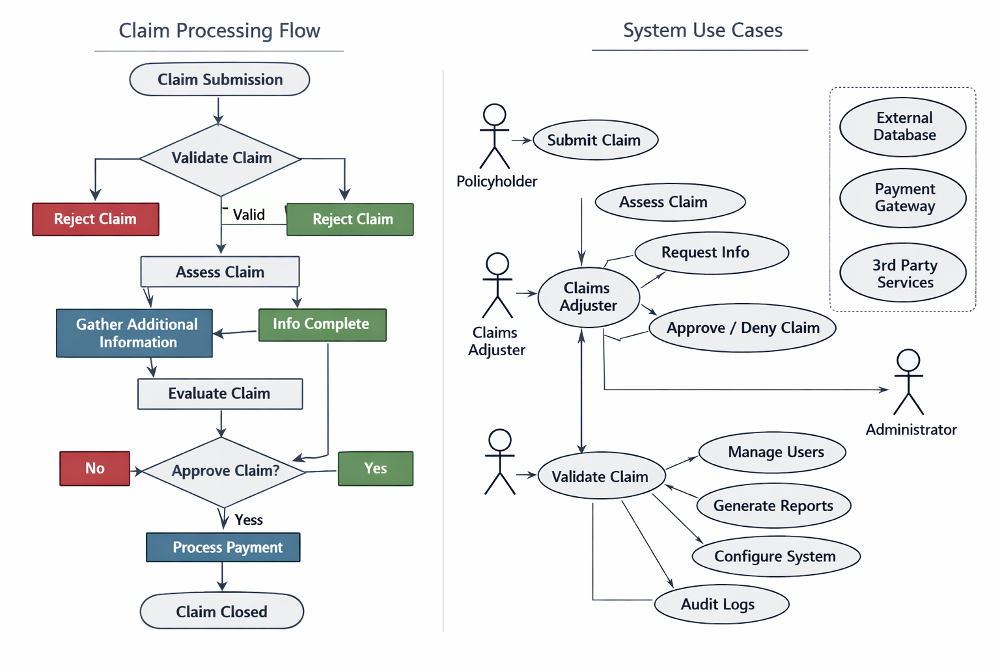

# Insurance Claim Management System (Java REST API)

## 📌Project Overview 

The project reflects a Technical Business Systems Analyst (BSA) perspective across the full SDLC lifecycle.

It demonstrates how business requirements in the insurance domain are translated into:

- Business Systems Analysis
- Software Development Lifecycle (SDLC)
- Java REST API Development
- Database Modeling
- Agile Delivery
- Reporting & Analytics
- System design
- Data handling
- Testing and validation
The system enables customers to submit insurance claims, allows agents and managers to process claims, and provides reporting dashboards for operational insights.

---

# 🎯 Project Objectives

- Streamline insurance claim processing
- Improve claim tracking and transparency
- Simulate enterprise SDLC workflows
- Demonstrate Business Analysis deliverables
- Showcase backend REST API development
- Integrate reporting and analytics capabilities
- Explore cloud and AI-based enhancements

---

# 📊 Claims Process Flow

The diagram below illustrates the end-to-end insurance claim workflow.



## Process Steps

1. Start
2. User Login
3. Submit Claim
4. Upload Documents
5. System Validation
6. Claim Review
7. Claim Approval or Rejection
8. Payment Processing
9. Claim Closure

---

# 🧩 System Use Cases

The use case diagram below shows the primary actors and their interactions with the system.



## Actors

### Customer
- Submit claims
- Upload supporting documents
- Track claim status

### Claims Agent
- Review claims
- Request additional information
- Approve or reject claims

### Administrator
- Manage users
- Generate reports
- Configure workflows
- Audit system activity

---

# 🏗️ System Workflow Diagram


The workflow demonstrates the complete insurance claim lifecycle from claim submission through review, approval, payment processing, and closure.

---
## Risk & Fraud Considerations

This Insurance Claim Management System is designed with awareness of common risk and fraud scenarios found in real-world insurance operations. While the current implementation focuses on core claim processing, the architecture supports future enhancement of risk-based controls.

### 1. Business Rule–Based Risk Indicators

The system can be extended to include rule-based checks to identify potentially high-risk claims, such as:

* Multiple claims submitted by the same policyholder within a short time period
* Claims submitted immediately after policy activation
* Unusual claim amounts compared to historical averages
* Repeated claims for similar damage patterns

These rules can be implemented as validation or flagging logic within the claim processing workflow.

### 2. Data Quality and Anomaly Detection

Strong data integrity is essential for reducing fraud risk. Potential enhancements include:

* Validation of mandatory fields (policy ID, incident date, claim type)
* Detection of inconsistent or incomplete claim data
* Cross-field validation (e.g., incident date cannot be after claim submission date)
* Identification of duplicate or near-duplicate claims

### 3. Exception Handling and Review Workflow

Claims identified as “high risk” or “suspicious” can be routed to a manual review process:

* Flagged claims are marked for investigation
* Additional approval required before claim settlement
* Audit trail maintained for all decisions

### 4. Auditability and Traceability

To support compliance and transparency, the system design considers:

* End-to-end tracking of claim status changes
* Logging of API requests and responses
* Record of user actions for each claim lifecycle stage
* Support for audit reviews and regulatory reporting

### 5. Future Enhancement (Advanced Fraud Detection)

Future versions of the system may incorporate:

* Predictive risk scoring models
* Machine learning–based anomaly detection
* Integration with external fraud databases
* AI-assisted claim classification and prioritization

These enhancements would strengthen the system’s ability to proactively identify and mitigate fraud risk in insurance operations.


# ⚙️ Key Features

- Secure authentication and login
- Online insurance claim submission
- Document upload and validation
- Automated claim status notifications
- Claims review and approval workflow
- Reporting and analytics support
- Appeal process for rejected claims

---

# 🎯 Business Problem

Insurance organizations require a controlled system to:

Manage insurance claims efficiently
Ensure data accuracy and consistency
Apply standardized business rules
Track claim lifecycle end-to-end
Support audit and regulatory compliance

Without structured systems, organizations face:

Data inconsistency
Slow claim processing
Limited traceability
High operational risk


---

# 🧠 Business Analysis Deliverables

## Included Artifacts

- Business Requirements Document (BRD)
- System Requirements Document (SRD)
- User Stories
- Use Cases
- Gap Analysis
- Impact Analysis
- Validation & Verification
- Requirements Traceability Matrix (RTM)
- Stakeholder Analysis
- Business Process Flow
- UAT Documentation

---

# 🧑‍💼 Project Scenario

## Client
Mid-size Insurance Provider

## Project
Claims Processing System Enhancement

The initiative focuses on improving efficiency, accuracy, transparency, and reporting capabilities within the insurance claims process.

---

# 🛠️ Scope of Work

- Gather and document business requirements
- Create functional specifications
- Design process and system diagrams
- Support data mapping and validation
- Assist with User Acceptance Testing (UAT)
- Support Agile collaboration processes

---

# 👩‍💼 My Role

## Business Systems Analyst

### Responsibilities

- Stakeholder needs analysis
- BRD and SRD documentation
- Process modeling and workflow design
- Use case and user story creation
- Collaboration between business and technical teams
- Requirement validation and traceability

---

# 📊 Analysis & Design Artifacts

The repository includes:

- ER Diagrams
- Flowcharts
- Sequence Diagrams
- Data Mapping Documents
- Process Models
- Architecture Diagrams
- UAT Documentation
- API Specifications

These artifacts support:

- Solution design
- Stakeholder communication
- Requirement validation
- Technical implementation alignment

---

# 🏗️ System Architecture

The solution follows a layered enterprise architecture:

```text
User
   ↓
REST API Layer
   ↓
Service Layer
   ↓
DTO Layer
   ↓
Repository Layer
   ↓
Database
```

Additional integrations include:

- Power BI Reporting
- AI Fraud Detection Concepts
- Cloud Deployment Architecture

---

# 💻 Technical Stack

## Backend
- Java
- Spring Boot
- REST APIs
- Maven

## Database
- MySQL
- SQL

## Testing
- JUnit
- Mockito
- Postman

## Reporting & Analytics
- Power BI
- Excel

## Enterprise Tools
- Jira
- Confluence
- Git
- Kanban

## Cloud & AI Concepts
- Cloud Deployment Architecture
- AI Fraud Detection Module

---

# 📂 Repository Structure

```text
Insurance-Claim-Management-System-Java-REST-API/
│
├── 01_BACKEND/
├── 02_BRD/
├── 03_SRD/
├── 04_UML_DIAGRAMS/
├── 05_API_SPECIFICATIONS/
├── 06_ARCHITECTURE/
├── 07_CLOUD_DEPLOYMENT/
├── 08_AI_MODULE/
├── 09_POWERBI_DASHBOARD/
├── 10_UAT/
├── 11_AUTOMATED_TESTING/
├── 12_ENTERPRISE_TOOLS/
├── 13_VERSION_CONTROL_GIT/
├── 14_REQUIREMENTS_TRACEABILITY/
├── 15_BUSINESS_ANALYSIS_ARTIFACTS/
├── 16_BUSINESS_PROCESS_FLOW/
├── images/
├── docs/
├── README.md
```

---

# 🔄 SDLC Lifecycle Demonstrated

This project simulates a full enterprise Software Development Lifecycle (SDLC):

1. Requirement Gathering
2. Business Analysis
3. System Design
4. API Development
5. Database Modeling
6. Testing & Validation
7. User Acceptance Testing (UAT)
8. Reporting & Analytics
9. Cloud Deployment Planning
10. AI Enhancement Concepts

---

# 📊 Power BI Dashboard

The reporting module includes dashboards for:

- Claim status tracking
- Monthly claim trends
- Claim approval metrics
- Fraud detection indicators

---

# 🤖 AI Enhancement Module

The AI module explores:

- Fraud detection
- Claim risk scoring
- Predictive analytics
- Intelligent claim classification

---

# ☁️ Cloud Deployment Concepts

Cloud deployment artifacts demonstrate:

- API hosting architecture
- Database deployment concepts
- Scalable cloud-ready infrastructure

---

# 🧪 Testing Strategy

Testing includes:

- Unit Testing
- Integration Testing
- API Testing
- User Acceptance Testing (UAT)

---

# 🔐 Version Control

Git version control practices demonstrated:

- Branching strategy
- Commit standards
- Pull request workflow
- Repository organization

---

# 🌟 Key Achievements

- Streamlined claims workflow design
- Improved requirement traceability
- Demonstrated enterprise-style documentation
- Simulated Agile project delivery practices
- Integrated technical and business analysis concepts
- Designed reporting and analytics capabilities

---

# 📈 Future Enhancements

Potential future improvements include:

- Frontend UI development
- Authentication & authorization
- Real-time notifications
- CI/CD pipeline integration
- Docker containerization
- Full cloud deployment implementation
- Advanced AI integration

---

# 📊 Key Outcomes

This project demonstrates:

- Converting business requirements into system design
- REST-based backend architecture understanding
- Enterprise workflow modeling
- Business and technical alignment
- End-to-end SDLC understanding

---

# 👤 Author

Fahmida Alam

Business Systems Analyst (CBAP) | Technical Analyst | Java Backend Enthusiast

---

# 📜 License

This project is licensed under the MIT License.


